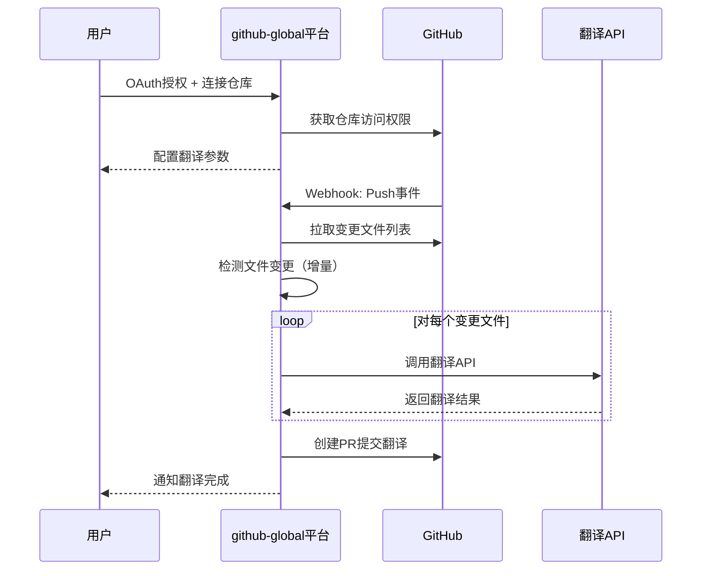

# GitHub Global - GitHub 仓库翻译工具

**需求规格文档 (PRD)**
**版本**: v1.0
**日期**: 2026-02-02
**产品名称**: github-global

---

## 📋 目录

1. [产品概述](#1-产品概述)
2. [市场调研](#2-市场调研)
3. [产品定位](#3-产品定位)
4. [核心功能](#4-核心功能)
5. [用户角色与场景](#5-用户角色与场景)
6. [功能需求](#6-功能需求)
7. [非功能需求](#7-非功能需求)
8. [技术架构](#8-技术架构)
9. [数据模型](#9-数据模型)
10. [界面原型](#10-界面原型)
11. [开发计划](#11-开发计划)
12. [风险与限制](#12-风险与限制)

---

## 1. 产品概述

### 1.1 产品愿景

构建一个通用的 GitHub 仓库自动化翻译 SaaS 平台，让开源项目作者能够轻松实现文档多语言化，打破语言壁垒，扩大项目的全球影响力。

### 1.2 核心价值

- **自动化翻译**: 无需人工干预，AI 自动将仓库文档翻译成多种语言
- **智能同步**: 基准语言内容变更时，自动同步更新翻译内容
- **通用性强**: 不局限于特定项目，任何 GitHub 仓库均可使用
- **灵活配置**: 支持用户自定义翻译引擎、目标语言、同步策略
- **非侵入式**: 通过 Pull Request 模式提交翻译，不污染原仓库主分支

### 1.3 目标用户

- **主要用户**: 开源项目作者、技术文档维护者
- **次要用户**: 国际化团队、跨国公司技术部门

---

## 2. 市场调研

### 2.1 竞品分析

#### 2.1.1 商业化平台

| 产品                  | 类型 | 优势                             | 劣势                     |
| --------------------- | ---- | -------------------------------- | ------------------------ |
| **Crowdin**     | SaaS | 功能完整、GitHub集成好、协作强大 | 价格昂贵、配置复杂       |
| **Transifex**   | SaaS | 企业级功能、团队协作完善         | 成本高、学习曲线陡峭     |
| **GitLocalize** | SaaS | 专为GitHub设计、界面简洁         | 功能相对简单、定价不透明 |
| **Lokalise**    | SaaS | 现代化UI、自动化强大             | 价格高、主要面向商业项目 |

#### 2.1.2 开源工具

| 产品                               | 技术栈        | 优势                         | 劣势                    |
| ---------------------------------- | ------------- | ---------------------------- | ----------------------- |
| **@qwen-code/translator**    | NPM包         | 自动同步、构建多语言站点     | 依赖Nextra、灵活性有限  |
| **Azure/co-op-translator**   | GitHub Action | Azure AI支持、易部署         | 绑定Azure、无可视化界面 |
| **Free-Markdown-Translator** | CLI           | 完全免费、支持多种翻译器     | 无自动化、需手动触发    |
| **md-translator**            | CLI           | 保留Markdown结构、高质量翻译 | 无Web界面、无GitHub集成 |

#### 2.1.3 GitHub Actions

| 产品                                | 优势                | 劣势               |
| ----------------------------------- | ------------------- | ------------------ |
| **Translate Markdown Action** | 易集成、自动触发    | 配置简单、功能单一 |
| **Auto-i18n**                 | 基于ChatGPT、质量高 | 需用户提供API密钥  |

### 2.2 市场机会

1. **痛点未解决**: 现有工具要么过于复杂（Crowdin），要么功能不足（简单Action）
2. **AI翻译成熟**: GPT-4/DeepL等翻译质量已达到实用级别
3. **开源全球化**: 中国开发者需要将中文项目推向国际市场
4. **SaaS化趋势**: 用户更倾向于"开箱即用"的托管服务

### 2.3 差异化优势

- **零配置启动**: 通过 GitHub OAuth 授权，5分钟内完成首次翻译
- **AI驱动**: 支持多种翻译引擎（OpenAI/DeepL/Google/Claude等）
- **智能同步**: 增量翻译检测，只翻译变更内容，节省成本
- **Pull Request模式**: 翻译结果以PR形式提交，保持原仓库整洁
- **可视化配置**: 直观的Web界面，无需编辑YAML文件

---

## 3. 产品定位

### 3.1 产品形态

**在线 SaaS 平台**

- 提供完整的 Web 服务
- 用户通过浏览器访问和管理
- 支持 GitHub OAuth + Personal Access Token 授权
- 托管部署，用户无需自建服务器

### 3.2 MVP 定位

**完整 MVP - 接近生产就绪**

- 不仅实现核心翻译流程，还包括用户系统、多仓库管理、历史记录等
- 验证完整的产品闭环，为后续商业化做准备

---

## 4. 核心功能

### 4.1 功能模块

```
github-global
├── 用户认证系统
│   ├── GitHub OAuth 登录
│   ├── Personal Access Token 绑定
│   └── 用户权限管理
│
├── 仓库管理系统
│   ├── 仓库连接/断开
│   ├── 仓库列表展示
│   └── 仓库配置管理
│
├── 翻译配置系统
│   ├── 基准语言设置
│   ├── 目标语言选择
│   ├── 翻译引擎配置
│   └── 同步策略设置
│
├── 翻译执行系统
│   ├── Webhook 监听
│   ├── 文件变更检测
│   ├── AI 翻译调用
│   ├── Pull Request 创建
│   └── 翻译任务队列
│
├── 历史记录系统
│   ├── 翻译历史查看
│   ├── 任务状态追踪
│   └── 错误日志记录
│
└── 数据分析系统
    ├── 翻译统计
    ├── 成本分析
    └── 使用报告
```

### 4.2 核心工作流程



---

## 5. 用户角色与场景

### 5.1 用户角色

| 角色                 | 描述             | 核心需求                               |
| -------------------- | ---------------- | -------------------------------------- |
| **仓库管理员** | GitHub仓库所有者 | 快速实现多语言、保持翻译同步、控制成本 |
| **开发者**     | 仓库贡献者       | 了解翻译状态、查看历史记录             |
| **访客**       | 仅查看权限       | 查看公开项目的翻译情况                 |

### 5.2 典型使用场景

#### 场景1: 首次翻译

> **用户**: 李鱼皮，开源了AI编程教程（纯中文）
> **目标**: 翻译成英文，吸引国际用户
>
> **操作流程**:
>
> 1. 访问 github-global.com
> 2. GitHub OAuth 登录
> 3. 连接 `liyupi/ai-guide` 仓库
> 4. 配置：基准语言=中文，目标语言=英文，翻译引擎=GPT-4
> 5. 点击"立即翻译"
> 6. 平台自动翻译所有文档，创建PR到仓库
> 7. 李鱼皮审核并合并PR

#### 场景2: 自动同步

> **触发**: 李鱼皮更新了3个中文文档，推送到main分支
> **自动化流程**:
>
> 1. GitHub发送Webhook到github-global
> 2. 平台检测到3个文件变更
> 3. 提取变更内容（增量检测）
> 4. 调用GPT-4翻译变更部分
> 5. 创建新的PR提交英文翻译
> 6. 李鱼皮收到邮件通知

#### 场景3: 多语言扩展

> **需求**: 项目火了，需要支持日语和西班牙语
>
> **操作流程**:
>
> 1. 在平台进入仓库配置页
> 2. 添加目标语言：日语（ja）、西班牙语（es）
> 3. 点击"立即翻译"生成初始翻译
> 4. 后续自动同步所有3种语言

---

## 6. 功能需求

### 6.1 用户认证系统 (MUST HAVE)

#### 6.1.1 GitHub OAuth 登录

- **优先级**: P0
- **描述**: 用户通过GitHub账号登录平台
- **功能点**:
  - [ ] GitHub OAuth 2.0 集成
  - [ ] 获取用户基本信息（username, avatar, email）
  - [ ] Session管理（JWT）
  - [ ] 登录态保持（7天免登录）

#### 6.1.2 Personal Access Token 绑定

- **优先级**: P0
- **描述**: 用户提供GitHub PAT以获得仓库操作权限
- **功能点**:
  - [ ] Token加密存储（AES-256）
  - [ ] Token权限验证（repo:Full control）
  - [ ] Token有效性检测
  - [ ] Token失效提醒

### 6.2 仓库管理系统 (MUST HAVE)

#### 6.2.1 仓库连接

- **优先级**: P0
- **描述**: 用户连接并授权平台访问其GitHub仓库
- **功能点**:
  - [ ] 展示用户的GitHub仓库列表
  - [ ] 搜索/筛选仓库
  - [ ] 选择仓库进行连接
  - [ ] 仓库权限验证
  - [ ] 设置Webhook（自动监听Push事件）

#### 6.2.2 仓库列表

- **优先级**: P0
- **描述**: 展示用户已连接的所有仓库
- **功能点**:
  - [ ] 仓库卡片展示（名称、描述、语言、Stars）
  - [ ] 仓库状态（已配置/未配置/翻译中）
  - [ ] 仓库操作（配置、断开、查看历史）
  - [ ] 分页/筛选

### 6.3 翻译配置系统 (MUST HAVE)

#### 6.3.1 基础配置

- **优先级**: P0
- **描述**: 配置仓库的翻译参数
- **功能点**:
  - [ ] **基准语言选择**: 源文档的语言（默认：auto-detect）
  - [ ] **目标语言选择**: 支持195+语言（ISO 639-1代码）
  - [ ] **文件路径配置**: 需要翻译的目录/文件（支持glob模式）
    - 默认：`**/*.md`, `**/*.txt`
    - 支持排除：`!**/node_modules/**`, `!**/dist/**`
  - [ ] **目标分支配置**: 翻译提交到的分支（默认：`i18n/{lang}`）
  - [ ] **Commit Message模板**: 自定义提交信息模板

#### 6.3.2 翻译引擎配置

- **优先级**: P0
- **描述**: 配置AI翻译服务的API密钥和参数
- **支持引擎**:
  - [ ] **OpenAI** (GPT-4/GPT-3.5)
    - API Key配置
    - 模型选择
    - 温度/Top-P参数
  - [ ] **DeepL API**
    - API Key配置
    - Free/Pro计划选择
  - [ ] **Google Translate**
    - API Key配置
    - 项目ID配置
  - [ ] **Anthropic Claude** (可选)
    - API Key配置
    - 模型选择
  - [ ] **Azure Translator** (可选)
    - API Key配置
    - 区域配置

#### 6.3.3 同步策略配置

- **优先级**: P1
- **描述**: 配置基准语言变更后的翻译同步策略
- **策略选项**:
  - [ ] **全量翻译**: 每次重新翻译整个文件（默认）
  - [ ] **智能增量**: 只翻译变更段落（基于Git Diff）
  - [ ] **手动触发**: 仅在用户手动触发时翻译
- **触发时机**:
  - [ ] 实时监听（Webhook）
  - [ ] 定时任务（Cron表达式）
  - [ ] 手动触发

### 6.4 翻译执行系统 (MUST HAVE)

#### 6.4.1 Webhook监听

- **优先级**: P0
- **描述**: 监听GitHub仓库的Push事件
- **功能点**:
  - [ ] Webhook endpoint接收
  - [ ] 签名验证（HMAC-SHA256）
  - [ ] 事件过滤（仅处理Push事件）
  - [ ] 变更文件提取
  - [ ] 任务队列加入

#### 6.4.2 文件变更检测

- **优先级**: P0
- **描述**: 分析Git Diff，提取需要翻译的内容
- **功能点**:
  - [ ] Git Diff解析
  - [ ] 文件类型过滤（仅.md/.txt）
  - [ ] 路径匹配（用户配置的glob模式）
  - [ ] 新增/修改文件标记
  - [ ] 删除文件同步（删除对应翻译文件）

#### 6.4.3 AI翻译调用

- **优先级**: P0
- **描述**: 调用配置的翻译API进行翻译
- **功能点**:
  - [ ] 文本分块（避免超过Token限制）
  - [ ] Markdown结构保留
    - 代码块不翻译
    - FrontMatter保留
    - 图片链接不翻译
    - 特殊标记处理（如 `[!NOTE]`）
  - [ ] 翻译上下文传递（文件名、项目描述）
  - [ ] 错误重试机制（指数退避）
  - [ ] API限流保护

#### 6.4.4 Pull Request创建

- **优先级**: P0
- **描述**: 将翻译结果提交为PR
- **功能点**:
  - [ ] 目标分支创建（如 `i18n/en`）
  - [ ] 文件路径转换（如 `docs/README.md` → `docs/en/README.md`）
  - [ ] Commit提交（使用配置的Message模板）
  - [ ] PR创建
  - [ ] PR模板（自动生成描述）
  - [ ] Label标记（如 `translation`, `automated`）
  - [ ] Reviewer分配（可选）

### 6.5 历史记录系统 (MUST HAVE)

#### 6.5.1 翻译历史

- **优先级**: P1
- **描述**: 记录所有翻译任务
- **功能点**:
  - [ ] 任务列表展示
  - [ ] 任务详情（触发方式、文件数量、状态）
  - [ ] 翻译对比（原文 vs 译文）
  - [ ] 时间线展示
  - [ ] 分页/筛选

#### 6.5.2 任务状态追踪

- **优先级**: P1
- **描述**: 实时追踪翻译任务状态
- **状态类型**:
  - [ ] Pending: 等待处理
  - [ ] Processing: 正在翻译
  - [ ] Completed: 翻译完成
  - [ ] Failed: 翻译失败
  - [ ] Cancelled: 用户取消
- **功能点**:
  - [ ] 实时状态更新（WebSocket）
  - [ ] 进度条显示
  - [ ] 失败原因展示

#### 6.5.3 错误日志

- **优先级**: P2
- **描述**: 记录翻译过程中的错误
- **功能点**:
  - [ ] 错误分类（API错误/网络错误/解析错误）
  - [ ] 错误详情展示
  - [ ] 错误日志导出
  - [ ] 错误重试按钮

### 6.6 数据分析系统 (NICE TO HAVE)

#### 6.6.1 翻译统计

- **优先级**: P2
- **描述**: 展示翻译相关的统计数据
- **功能点**:
  - [ ] 总翻译字数
  - [ ] 翻译文件数量
  - [ ] 目标语言分布
  - [ ] 翻译频率趋势图

#### 6.6.2 成本分析

- **优先级**: P2
- **描述**: 分析翻译成本
- **功能点**:
  - [ ] Token消耗统计
  - [ ] 预估成本计算（按API定价）
  - [ ] 成本趋势图
  - [ ] 成本对比（不同引擎）

#### 6.6.3 使用报告

- **优先级**: P3
- **描述**: 生成使用报告
- **功能点**:
  - [ ] 周报/月报
  - [ ] PDF导出
  - [ ] 邮件推送

---

## 7. 非功能需求

### 7.1 性能要求

| 指标               | 要求      | 说明                 |
| ------------------ | --------- | -------------------- |
| **并发支持** | 100+ 仓库 | 同时处理的翻译任务数 |

### 7.2 安全要求

- [ ] **数据加密**: Token使用AES-256加密存储
- [ ] **HTTPS**: 全站SSL/TLS加密
- [ ] **Webhook验证**: 验证GitHub签名
- [ ] **权限隔离**: 用户只能访问自己的仓库
- [ ] **API密钥保护**: 不在日志中暴露密钥
- [ ] **SQL注入防护**: 使用ORM/参数化查询
- [ ] **XSS防护**: 输出转义、CSP策略
- [ ] **CSRF防护**: Token验证

### 7.3 可用性要求

- [ ] **容错性**: API调用失败自动重试
- [ ] **数据备份**: 每日自动备份数据库
- [ ] **监控告警**: 服务异常实时通知

### 7.4 可扩展性要求

- [ ] **水平扩展**: 支持多实例部署
- [ ] **队列系统**: 翻译任务异步处理
- [ ] **缓存策略**: Redis缓存热点数据
- [ ] **数据库索引**: 优化查询性能

### 7.5 兼容性要求

| 类别               | 支持                                          |
| ------------------ | --------------------------------------------- |
| **浏览器**   | Chrome 90+, Firefox 88+, Safari 14+, Edge 90+ |
| **GitHub**   | GitHub.com, GitHub Enterprise                 |
| **文件编码** | UTF-8                                         |
| **Markdown** | CommonMark, GitHub Flavored Markdown          |


---


## 8. 风险与限制

### 8.1 技术风险

| 风险                       | 影响 | 概率 | 应对措施                         |
| -------------------------- | ---- | ---- | -------------------------------- |
| **翻译API不稳定**    | 高   | 中   | 多引擎支持、自动重试、降级策略   |
| **GitHub API限流**   | 中   | 高   | 请求队列、缓存、指数退避         |
| **Markdown解析错误** | 中   | 中   | 充分测试、边界处理、人工审核机制 |
| **数据库性能瓶颈**   | 高   | 低   | 索引优化、缓存、读写分离         |
| **Webhook丢失**      | 中   | 低   | 幂等设计、手动重试、监控告警     |

### 8.2 业务风险

| 风险                      | 影响 | 概率 | 应对措施                     |
| ------------------------- | ---- | ---- | ---------------------------- |
| **翻译质量不达标**  | 高   | 中   | 提供人工审核机制、翻译评分   |
| **用户API密钥泄露** | 高   | 低   | 加密存储、安全审计、免责声明 |
| **成本控制失效**    | 中   | 中   | 添加配额限制、成本告警       |
| **用户隐私问题**    | 高   | 低   | 隐私政策、数据隔离、GDPR合规 |

### 8.3 合规风险

| 风险                     | 影响 | 应对措施                                     |
| ------------------------ | ---- | -------------------------------------------- |
| **GitHub ToS违规** | 高   | 遵守GitHub API使用条款、设置合理的Rate Limit |
| **数据跨境传输**   | 中   | 服务器部署在用户所在区域、数据本地化         |
| **开源协议兼容**   | 低   | 翻译内容的License继承、用户确认              |

### 8.4 限制条件

1. **功能限制 (MVP阶段)**

   - 仅支持Markdown和纯文本文件
   - 仅支持GitHub.com，暂不支持GitHub Enterprise
   - 单次翻译文件数限制：100个
   - 单文件大小限制：1MB
2. **技术限制**

   - 依赖第三方翻译API的可用性和质量
   - 依赖GitHub Webhook的实时性
   - 受限于GitHub API的调用频率
3. **商业限制**

   - 不承担翻译质量问题导致的损失
   - 不保证翻译API的100%可用性
   - 保留服务的商业化权利（未来可能收费）

---

## 9. 成功指标

### 9.1 MVP成功标准

| 指标                  | 目标值 | 说明                   |
| --------------------- | ------ | ---------------------- |
| **注册用户数**  | 100+   | 3个月内                |
| **连接仓库数**  | 50+    | 3个月内                |
| **翻译完成率**  | > 95%  | 成功完成的翻译任务比例 |
| **翻译准确率**  | > 85%  | 用户满意度和审核通过率 |
| **API响应时间** | < 2s   | P95响应时间            |
| **服务可用性**  | > 99%  | uptime                 |

### 9.2 核心指标

| 指标                           | 定义                     |
| ------------------------------ | ------------------------ |
| **DAU/MAU**              | 日活/月活用户数          |
| **Translation Velocity** | 平均每仓库每天翻译文件数 |
| **PR Merge Rate**        | 翻译PR被合并的比例       |
| **Retention Rate**       | 用户留存率（7日/30日）   |
| **NPS**                  | 用户净推荐值             |

---

## 9. 后续规划

### 9.1 V2 功能规划

1. **团队协作**

   - 多人协作翻译
   - 审核机制
   - 权限管理
2. **高级功能**

   - 代码注释翻译
   - YAML/JSON i18n文件翻译
   - 图片OCR翻译
3. **质量提升**

   - 翻译记忆库
   - 术语表管理
   - 翻译评分系统
4. **企业功能**

   - 私有仓库支持
   - SSO单点登录
   - 专属部署

### 9.2 商业化模式

1. **免费版**

   - 3个仓库
   - 5万字符/月
   - 社区支持
2. **专业版** ($19/月)

   - 无限仓库
   - 100万字符/月
   - 优先支持
3. **团队版** ($99/月)

   - 5人团队
   - 500万字符/月
   - 邮件支持
4. **企业版** (定制)

   - 无限用户
   - 无限字符
   - 专属支持 + SLA

---

## 9. 附录

### 9.1 参考资源

- **GitHub API文档**: https://docs.github.com/en/rest
- **OpenAI API文档**: https://platform.openai.com/docs
- **DeepL API文档**: https://developers.deepl.com/
- **CommonMark规范**: https://commonmark.org/

### 9.2 术语表

| 术语              | 说明                                 |
| ----------------- | ------------------------------------ |
| **i18n**    | Internationalization，国际化         |
| **l10n**    | Localization，本地化                 |
| **MVP**     | Minimum Viable Product，最小可行产品 |
| **PR**      | Pull Request，拉取请求               |
| **PAT**     | Personal Access Token，个人访问令牌  |
| **Webhook** | Web回调，HTTP推送                    |

### 9.3 变更记录

| 版本 | 日期       | 变更内容 | 作者   |
| ---- | ---------- | -------- | ------ |
| v1.0 | 2026-02-02 | 初始版本 | Claude |

---

**文档结束**

📞 如有任何疑问，请联系项目组
